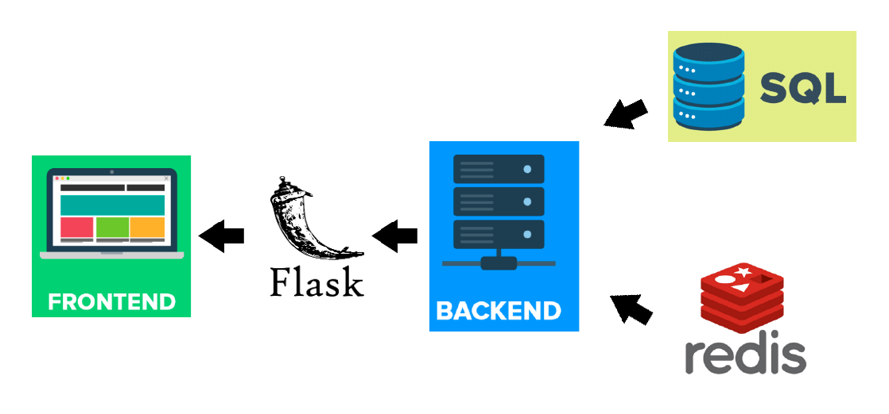

# TC3041 Proyecto  Final Primavera 2019

#*Papyrus*
---

##### Integrantes:
1. *Moisés Uriel Torres*
2. *Carlos Daniel Atilano*

---
## 1. Aspectos generales

### 1.1 Requerimientos técnicos

A continuación se mencionan los requerimientos técnicos mínimos del proyecto, favor de tenerlos presente para que cumpla con todos.

* El equipo tiene la libertad de elegir las tecnologías de desarrollo a utilizar en el proyecto, sin embargo, debe tener presente que la solución final se deberá ejecutar en una plataforma en la nube. Puede ser  [Google Cloud Platform](https://cloud.google.com/?hl=es), [Azure](https://azure.microsoft.com/en-us/) o AWS [AWS](https://aws.amazon.com/es/free/).
* El proyecto debe utilizar al menos dos modelos de bases de datos diferentes, de los estudiados en el curso.
* La solución debe utilizar una arquitectura de microservicios. Si no tiene conocimiento sobre este tema, le recomiendo la lectura [*Microservices*](https://martinfowler.com/articles/microservices.html) de [Martin Fowler](https://martinfowler.com).
* La arquitectura debe ser modular, escalable, con redundancia y alta disponibilidad.
* La arquitectura deberá estar separada claramente por capas (*frontend*, *backend*, *API RESTful*, datos y almacenamiento).
* Los diferentes componentes del proyecto (*frontend*, *backend*, *API RESTful*, bases de datos, entre otros) deberán ejecutarse sobre contenedores [Docker](https://www.docker.com/) y utilizar [Kubernetes](https://kubernetes.io/) como orquestador.
* Todo el código, *datasets* y la documentación del proyecto debe alojarse en un repositorio de GitHub siguiendo al estructura que aparece a continuación.

### 1.2 Estructura del repositorio

```
- / 	                # Raíz de todo el proyecto
    - App/              # Raíz de la aplicación
          - frontend    # Carpeta con la solución del frontend (Web app)
          - backend     # Carpeta con la solución del backend (CMS)
          - dbs         # Carpeta con los modelos, catálogos y scripts necesarios para generar las bases de datos
          - __init__    # Archivo principal de la aplicación
    - run.py            # Archivo de ejecución del programa
    - README.md			# Archivo con los datos del proyecto (este archivo)
```

### 1.3 Documentación  del proyecto

Como parte de la entrega final del proyecto, se debe incluir la siguiente información:

* Justificación de los modelo de *bases de datos* que seleccionaron.
* Descripción del o los *datasets* y las fuentes de información utilizadas.
* Guía de configuración, instalación y despliegue de la solución en la plataforma en la nube  seleccionada.
* Documentación de la API. Puede ver un ejemplo en [Swagger](https://swagger.io/). 
* El código debe estar documentado siguiendo los estándares definidos para el lenguaje de programación seleccionado.

## 2. Descripción del proyecto

Nosotros decidimos hacer una aplicación web a la que llamamos Papyrus. Papyrus es una aplicación dedicada a todas las personas que les guste leer y que quieran escuchar la opinión de otras personas acerca de un libro en específico. En Papyrus los usuarios pueden crearse una cuenta para acceder a la página web de cada libro y así leer todas sus reseñas o escribir una reseña ellos mismos. 

## 3. Solución

A continuación aparecen descritos los diferentes elementos que forman parte de la solución del proyecto.

### 3.1 Modelos de *bases de datos* utilizados

- SQL: utilizamos una base de datos sql para administrar la información de todos los usuarios, libros y reseñas. Utilizamos SQLalchemy para vincular la db con python. Decidimos utilizamor este modelo de base de datos (en vez de uno noSQL) porque nuestro programa funciona mejor con una base de datos normalizada, aparte de que no tenemos muchas tablas y no necesitamos hacer tantos joins, por lo que no nos afecta usar una base de datos sql. Aparte, en flask (el framework que utilizamos para desarrollar la app) es mucho más fácil trabajar con SQLalchemy que con pymongo o algún otro modelo de mongo.
Los datasets que utilizamos fueron el de usuarios, el de libros y el de reseñas. Los datos de los usuarios se crean al momento de que un usuario se registra, los de reseñas al momento de que un usuario deja una reseña y el de libros nosotros lo creamos insertando los datos manualmente. Actualmente la db cuenta con solo 12 libros, pero se le podrían agregar más y automaticamente se añadirían a la página

- redis: utilizamos redis para administrar las sesiones de los usuarios. Esto es muy útil ya que así las sesiones son administradas desde un servidor en vez de cache. Para esto usamos la librería flask-session que utiliza un servidor de redis y permite administrarlo desde flask. Los registros de los usuarios se crean al momento de que inician sesión.

### 3.2 Arquitectura de la solución



### 3.3 Frontend
Para el frontend de nuestra aplicación utilizamos únicamente html y css, en conjunto con algunos componentes de bootstrap.

#### 3.3.1 Lenguaje de programación
Python en conjunto con html y css

### 3.4 Backend
Para desarrollar nuestra aplicación decidimos utilizar flask y un framework especializado en desarrollo web llamado flask. Utilizamos varias librerías de flask y también de las base de datos que utilizamos.

#### 3.4.1 Lenguaje de programación
Python

#### 3.4.2 Framework
Flask

#### 3.4.3 Librerías de funciones o dependencias
- flask
- flask-wtf
- flask-sqlalchemy
- flask-bcrypt
- flask-session
- redis

## 3.6 Pasos a seguir para utilizar el proyecto


## 4. Referencias

- Documentación de Flask: http://flask.pocoo.org/docs/1.0/
- Documentación de Flask-wtf: https://flask-wtf.readthedocs.io/en/stable/
- documentación de Flask-bcrypt: https://flask-bcrypt.readthedocs.io/en/latest/
- Documentación de Flask-session: https://pythonhosted.org/Flask-Session/
- Api de Flask-SQLalchemy: https://flask-sqlalchemy.palletsprojects.com/en/2.x/api/

- Tutorial para flask-session: https://www.tutorialspoint.com/flask/flask_sessions.htm
- Tutorial de aplicaciones web en flask: https://www.youtube.com/watch?v=MwZwr5Tvyxo&list=PL-osiE80TeTs4UjLw5MM6OjgkjFeUxCYH
